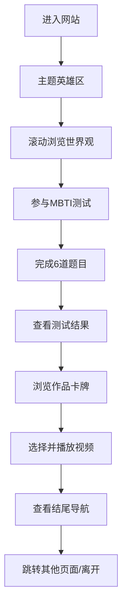

## 1. 产品概述

本项目是一个现代化平面风格的个人作品展示静态网站，采用垂直滚动分区块的设计理念，展示创作者的世界观、作品与互动体验。网站面向访客、合作伙伴与粉丝群体，通过沉浸式的视觉设计与互动模块，传递创作者的独特风格与作品价值。

## 2. 核心功能

### 2.1 功能模块

1. **首页（单页滚动）**：主题英雄区、世界观介绍、MBTI性格测试、测试结果展示、作品卡牌画廊、视频选择播放、精选视频、结尾导航、版权信息
2. **全局悬浮组件**：BGM音乐播放器（右上角悬浮，播放/静音切换）

### 2.2 页面详情

| 页面名称 | 模块名称 | 功能描述 |
|-----------|-------------|---------------------|
| 首页 | 主题英雄区 | 全屏视觉展示，大标题与副标题，动态背景装饰 |
| 首页 | 世界观介绍 | 文本叙事 + 动态几何背景，营造沉浸氛围 |
| 首页 | MBTI测试模块 | 6道二选一题目，逐步答题，计算性格类型 |
| 首页 | MBTI结果展示 | 显示用户测试结果 + 全部16种MBTI类型概览 |
| 首页 | 作品卡牌画廊 | 大量作品卡片网格排列，悬停动效 |
| 首页 | 视频选择区 | 3个视频缩略图（A/B/C），点击切换播放 |
| 首页 | 精选视频区 | 单个全屏/大尺寸视频展示 |
| 首页 | 结尾导航区 | 创作者信息 + 其他页面跳转链接 |
| 首页 | 版权页脚 | 版权声明与基础信息 |
| 全局 | BGM播放器 | 右上角悬浮圆形按钮，播放/静音切换，音乐自动播放（用户交互后） |

## 3. 核心流程

## 4. 用户界面设计

### 4.1 设计风格

- **主色调**：深邃紫黑（#0d0820）作为基底，搭配紫色系渐变作为主题色
- **主题四色**：
  - 主紫 #7E4DF4（品牌主色，用于按钮、强调元素）
  - 淡蓝紫 #96AEFE（辅助色，用于渐变、高亮）
  - 青蓝 #52BAE7（点缀色，用于图标、装饰）
  - 深紫 #4228FF（深色强调，用于渐变终点、重要元素）
- **配色逻辑**：以四个紫色系色号为核心，构建从浅到深的渐变体系，营造梦幻科技感
- **设计风格**：现代平面 + 赛博朋克质感，几何图形装饰，渐变光晕，玻璃态卡片
- **字体**：标题使用 Space Grotesk / 思源黑体 Heavy，正文使用 Inter / 思源黑体 Regular
- **按钮风格**：扁平直角或微圆角，霓虹边框发光效果，悬停时填充渐变
- **布局风格**：垂直分区块，每屏一个主题，大量留白与负空间
- **图标风格**：线性几何图标，霓虹发光效果

### 4.2 页面设计概览

| 页面名称 | 模块名称 | UI 元素 |
|-----------|-------------|-------------|
| 首页 | 主题英雄区 | 超大标题、渐变文字、动态几何粒子背景、向下滚动提示 |
| 首页 | 世界观介绍 | 左右分栏文本、动态浮动几何图形、磨砂玻璃文字容器 |
| 首页 | MBTI测试模块 | 进度条、问题卡片、二选一大按钮、翻转动画 |
| 首页 | MBTI结果展示 | 结果大卡片（霓虹边框）、16型人格网格缩略图 |
| 首页 | 作品卡牌画廊 | 自适应网格、卡片悬停上浮、图片+标题+标签 |
| 首页 | 视频选择区 | 三个视频缩略图并排、播放按钮、选中态高亮 |
| 首页 | 精选视频区 | 大尺寸视频播放器、视频标题与描述 |
| 首页 | 结尾导航区 | 创作者头像/Logo、社交链接、页面跳转按钮 |
| 首页 | 版权页脚 | 版权文字、极简分割线 |
| 全局 | BGM播放器 | 圆形悬浮按钮、播放/暂停图标切换、脉冲动画、右上角固定定位 |

### 4.3 响应式设计

- 桌面端优先设计，适配 1920px、1440px、1024px
- 平板端：网格列数减少，字号适当缩小
- 移动端：单列布局，触摸友好的按钮尺寸，精简装饰元素
- 所有动画在移动端降级为简洁版本，保证性能

### 4.4 动效与交互

- 页面滚动：各区块依次淡入，视差滚动效果
- MBTI答题：题目切换平滑过渡，选项点击波纹反馈
- 卡牌悬停：上浮 + 发光边框 + 图片微缩放
- 视频切换：淡入淡出过渡
- 背景粒子：缓慢漂浮的几何图形，鼠标移动产生微弱引力
