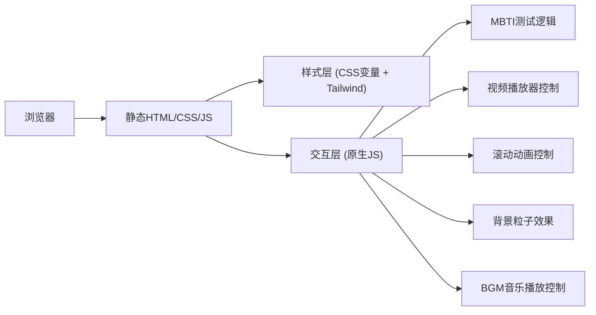

## 1. 架构设计



## 2. 技术说明

- **前端技术栈**：原生 HTML5 + CSS3 + JavaScript (ES6+)
- **CSS 框架**：Tailwind CSS v3（CDN引入，便于快速开发与扩展）
- **构建工具**：无构建工具，纯静态文件，方便用户直接修改与部署
- **图标**：Lucide Icons（通过CDN引入SVG图标）
- **字体**：Google Fonts（Space Grotesk + Noto Sans SC）
- **视频**：HTML5 Video 标签，支持自定义控制

## 3. 目录结构

```
/
├── index.html          # 主页面，包含所有区块
├── css/
│   └── style.css       # 自定义样式，覆盖Tailwind与动画
├── js/
│   ├── mbti.js         # MBTI测试逻辑
│   ├── video.js        # 视频播放控制
│   ├── particles.js    # 背景粒子/几何动画
│   ├── scroll.js       # 滚动动画与交互
│   └── bgm.js          # BGM音乐播放控制
├── assets/
│   ├── images/         # 图片资源（卡牌、背景等）
│   ├── videos/         # 视频资源
│   └── audio/          # 音频资源（BGM等）
└── README.md           # 项目说明
```

## 4. 数据结构

### 4.1 MBTI 题目数据

```javascript
const mbtiQuestions = [
  {
    id: 1,
    dimension: "E/I", // 外向/内向
    question: "在周末，你更倾向于...",
    options: [
      { label: "参加聚会，和朋友们一起", value: "E" },
      { label: "独自在家，享受安静时光", value: "I" }
    ]
  },
  // ... 共6道题，覆盖E/I, S/N, T/F, J/P四个维度
];
```

### 4.2 MBTI 结果数据

```javascript
const mbtiResults = {
  "INTJ": { name: "建筑师", description: "...", traits: ["战略思维", "独立", "高标准"] },
  // ... 共16种类型
};
```

### 4.3 作品卡牌数据

```javascript
const artworks = [
  { id: 1, title: "作品名称", image: "assets/images/art1.jpg", tags: ["插画", "概念设计"] },
  // ... 多条数据
];
```

### 4.4 视频数据

```javascript
const videos = {
  a: { title: "视频A", src: "assets/videos/a.mp4", thumbnail: "assets/images/thumb-a.jpg" },
  b: { title: "视频B", src: "assets/videos/b.mp4", thumbnail: "assets/images/thumb-b.jpg" },
  c: { title: "视频C", src: "assets/videos/c.mp4", thumbnail: "assets/images/thumb-c.jpg" },
  feature: { title: "精选视频", src: "assets/videos/feature.mp4" }
};
```

### 4.5 BGM 数据

```javascript
const bgmConfig = {
  src: "assets/audio/bgm.mp3",
  autoPlay: true,
  loop: true,
  volume: 0.5
};
```

## 5. 扩展指南

- **新增区块**：在 `index.html` 中添加 `<section>`，在 `style.css` 中添加对应样式
- **新增MBTI题目**：在 `js/mbti.js` 的 `mbtiQuestions` 数组中追加题目
- **新增作品卡牌**：在 `index.html` 的画廊容器中复制卡片模板，或在 `js/` 中添加数据驱动渲染
- **修改配色**：在 `style.css` 顶部的 CSS 变量中修改颜色值
